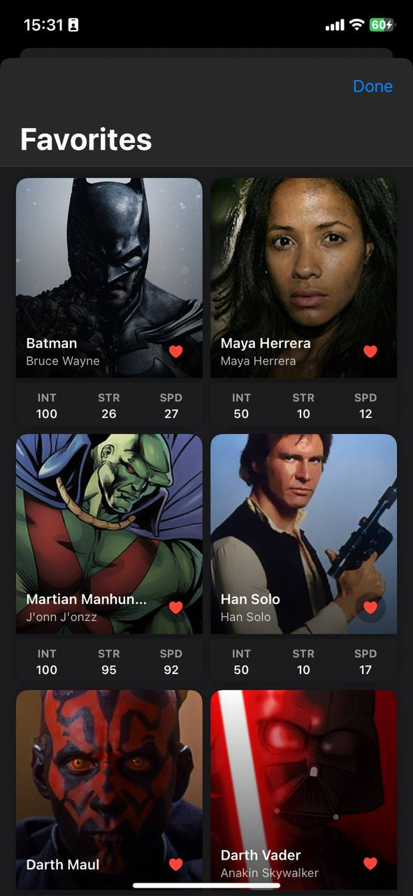

# HeroRandomizer App

## Overview
HeroRandomizer is an iOS application that displays random superheroes from the Superhero API. The app allows users to explore superhero data, search for specific heroes, and save their favorites.

## Implementation Details

### Architecture
The project follows a hybrid architecture that combines UIKit and SwiftUI:

- **UIKit**: Used as the base framework for the application
- **SwiftUI**: Used for creating modern, declarative UI components
- **Combine**: Used for reactive programming and handling data flow

The app employs the MVVM (Model-View-ViewModel) pattern:
- **Models**: Define the data structure (Superhero, PowerStats, etc.)
- **Views**: Display the UI (HeroDetailView, HeroListView, etc.)
- **ViewModels**: Handle business logic and data transformation (HeroViewModel)

### Key Components

#### 1. Data Models
- `Superhero`: Main data model representing a superhero
- `PowerStats`, `Appearance`, `Biography`, etc.: Sub-models for specific hero attributes

#### 2. Networking
- `NetworkManager`: Singleton class that handles API requests using Combine
- Uses URLSession and Combine to fetch and process data

#### 3. Persistence
- `FavoritesManager`: Manages user's favorite heroes using UserDefaults

#### 4. UI Components
- **SwiftUI Views**:
  - `HeroListView`: Main view displaying random heroes
  - `HeroDetailView`: Detailed view showing hero attributes
  - `FavoritesView`: Shows user's saved favorites
  - `HeroCard`: Reusable component for hero display
  - Supporting views for loading and error states

- **UIKit Integration**:
  - `MainViewController`: Hosts SwiftUI views using UIHostingController
  - `SceneDelegate`: Sets up the app's window and root view controller

### Features

#### Core Features
- Random hero selection with attractive visual presentation
- Detailed hero information showing 10+ attributes
- Visually appealing UI with custom components

#### Bonus Features
1. **Favorites System**:
   - Users can save heroes to favorites by tapping the heart icon
   - Favorites are persisted between app launches using UserDefaults
   - Dedicated favorites view to browse saved heroes

2. **Search Functionality**:
   - Real-time search as you type
   - Searches both hero names and real names
   - Visual feedback and empty state handling

3. **Animations**:
   - Smooth transitions between views
   - Loading animations
   - Favorites button animation

### UI/UX Considerations
- Responsive layout that works on different iPhone sizes
- Dark/light mode support
- Loading and error state handling
- Empty state handling for search and favorites
- Visual feedback for user interactions

### Technical Decisions

1. **Combine vs Async/Await**:
   - Used Combine for reactive programming and data flow
   - Helps with handling async operations and propagating changes

2. **SwiftUI Integration**:
   - Used UIHostingController to embed SwiftUI views in UIKit
   - Allows for taking advantage of SwiftUI's declarative syntax while maintaining UIKit project structure

3. **Singleton Pattern**:
   - Used for NetworkManager and FavoritesManager to ensure single instances across the app

4. **Error Handling**:
   - Custom error types and visual error states
   - User-friendly error messages with retry functionality

## Screenshots

   <figure style="margin: 0; padding: 0;">
      
        <figcaption>Main Menu</figcaption>
    </figure>

   <figure style="margin: 0; padding: 0;">
      
        <figcaption>Detailed View</figcaption>
   </figure>

   <figure style="margin: 0; padding: 0;">
      
        <figcaption>Favorites View</figcaption>
    </figure>

## Video Demonstration

You can watch the demonstration from youtube: https://youtube.com/shorts/Mwtz0Ney6bc?feature=shared

## Setup Instructions

1. Clone the repository
2. Open the project in Xcode
3. Build and run on your device or simulator
